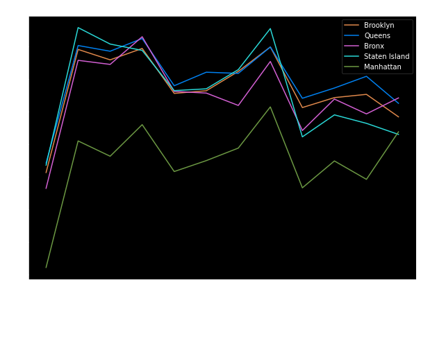
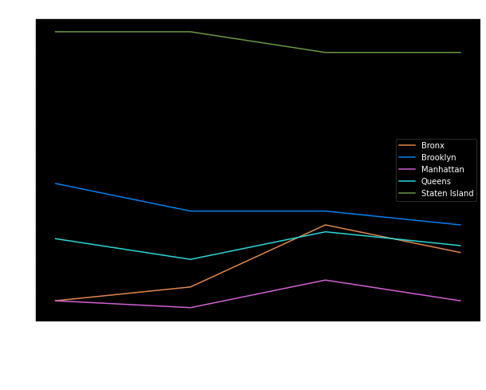
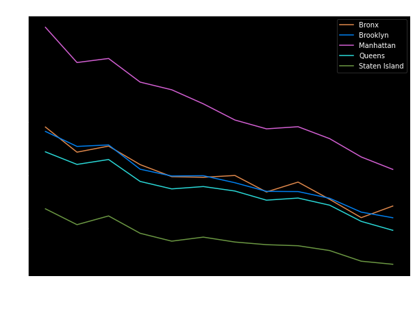
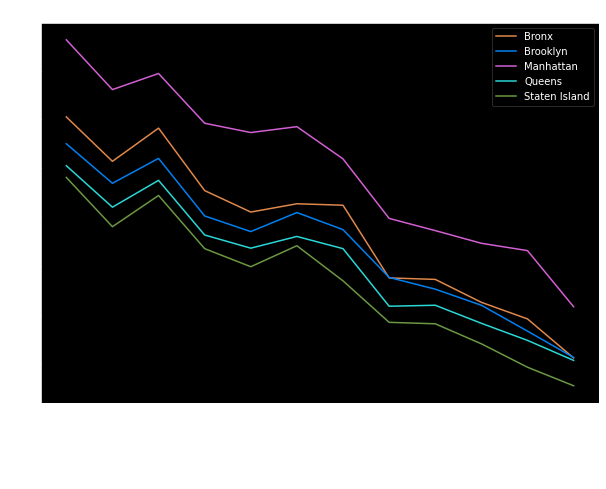
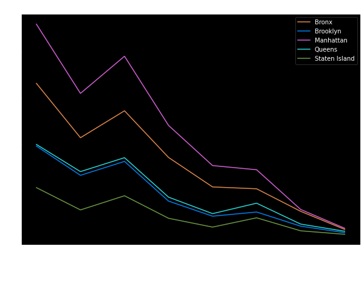

# NYC Air Quality Data Analysis

In this project, we analyzed the air quality data of New York City using various data analysis techniques and visualization tools. We focused on four main pollutants: Nitrogen dioxide, Sulfur dioxide, Ozone, and PM2.5, which significantly impact the air quality. By utilizing Jupyter Notebook and the Pandas library, we were able to efficiently process and analyze the data. We also employed Matplotlib for creating informative charts and plots to visualize the trends and patterns.

### Highlights of the Project:
- Positive trend in air quality improvement in New York City over the past decade.
- Decline in emissions of Nitrogen dioxide and PM2.5, indicating the effectiveness of emission norms and regulations.
- Significant decrease in Sulfur dioxide levels during winter due to the city's efforts to phase out residual heating oil.
- Relatively stable ozone levels, but further action is needed to reduce ozone-related health issues.

### Objectives of Presenting Findings:
- Raise awareness about the importance of maintaining good air quality.
- Emphasize the need for continued efforts to reduce pollution.

### Encouragement for Individual Actions:
- Conservation of energy.
- Turning off lights and electrical equipment when not in use.
- Avoiding unnecessary vehicle idling.

### Call for Collective Contribution to a Greener Future:
- Ensuring a healthier environment for ourselves and future generations.

### Data Source:
- Air Quality dataset obtained from NYC Open Data.






## Data

The data for this project is located in the `data/` subfolder. The following files are included:

- Air_Quality.csv: Contains air quality information on NYC. 

## Project Video

We have also created a video describing our project, which you can find in the following link: 

https://drive.google.com/file/d/1KEqs8lQBvLCpyZcSesLCoGdds7ltcOMH/view?usp=sharing

## Group Members

| Name                
| -------------------| 
| Chashi Mahiul Islam |
| Venkat Vijay |


