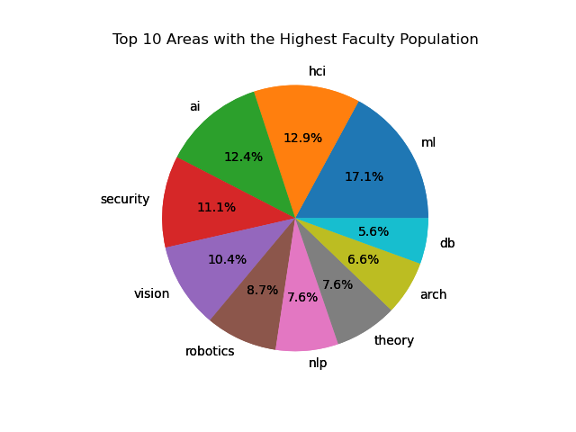
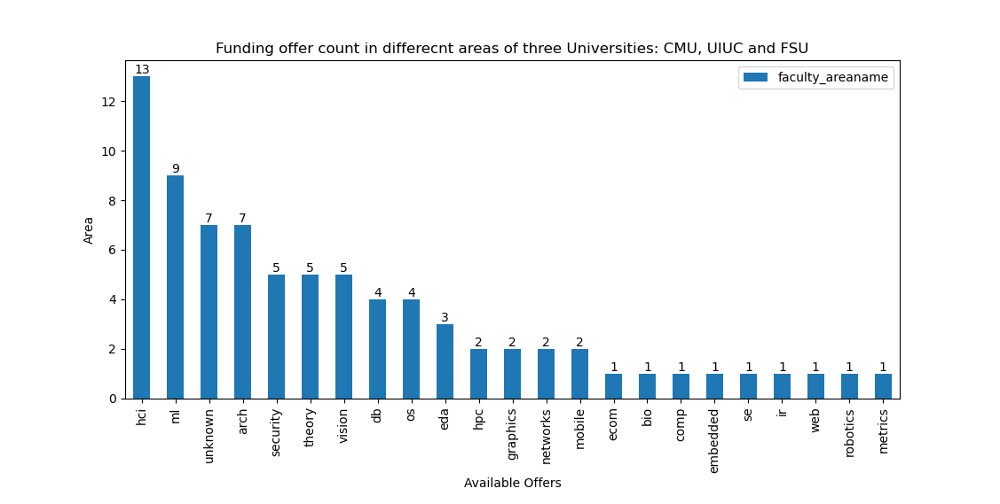
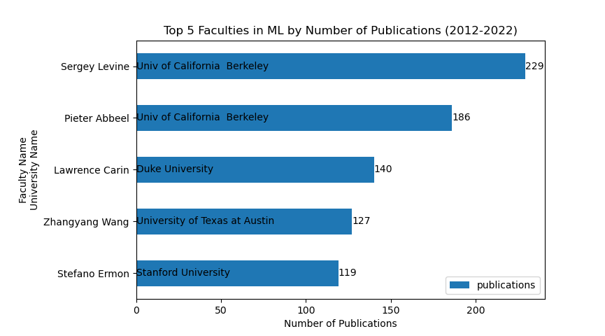

# Webscrapping: Funding Offer

In this project, we focused on addressing the challenge of finding funding opportunities for international students pursuing higher education in the United States. We recognized that the high cost of tuition and living expenses, coupled with the requirement to demonstrate sufficient funds, posed significant hurdles for students from low-income backgrounds or countries with weak currencies. To tackle this problem, we aimed to create a website that would showcase funding opportunities provided by professors in various fields.

Funding challenges for international students in higher education:

High cost of tuition, fees, and living expenses.
Requirement to demonstrate sufficient funds for the entire duration of studies.
Particularly burdensome for students from low-income backgrounds or countries with weak currencies.

Need for a comprehensive website to showcase funding opportunities:

No existing platform for international students to search for funding by professors in their field.
Google and ChatGPT did not provide satisfactory results.

Extracting data from CSRank for Computer Science faculties:

CSRank ranks US universities' Computer Science departments based on faculty publications.
Collected extensive information on professors: names, research areas, publication counts, etc.
Focus on publications from 2012 to 2022.

Tools and libraries used:

requests, Selenium, BeautifulSoup, pandas, and re for web scraping.
Matplotlib for visualization.

Overcoming challenges:

Selenium used to scrape dynamic table data from CSRank.
pandas utilized to extract nested table information.
Created a dataset for faculties from three universities: Carnegie Mellon, UIUC, and FSU.

Visualizing findings:

Pie chart showcasing faculty distribution across different fields.
Bar plot indicating areas where professors from the three universities seek new students.

Focus on specific universities and keywords:

Limited scope to three universities due to time and computational constraints.
Dataset created with keywords indicating professors' interest in new students.

Discovering potential funding opportunities:

Identified professors at FSU, such as Dr. Jie Wang and Dr. Guan Wang, in the HCI field.
Examined their homepages to gather information on assistantship opportunities.

Future enhancements:

Consider freshness of professor's web pages.
Incorporate additional relevant keywords for a more comprehensive search.

[]
[]
[]

## Data

The data for this project is located in the `data/` subfolder. 

## Project Video

We have also created a video describing our project, which you can find in the following link: 

https://drive.google.com/file/d/1GW4xjkDRePKWaECQIUNWP5vDLA40ybk-/view?usp=sharing

## Group Members

| Name                
| -------------------| 
| Chashi Mahiul Islam |
| Venkat Vijay |


